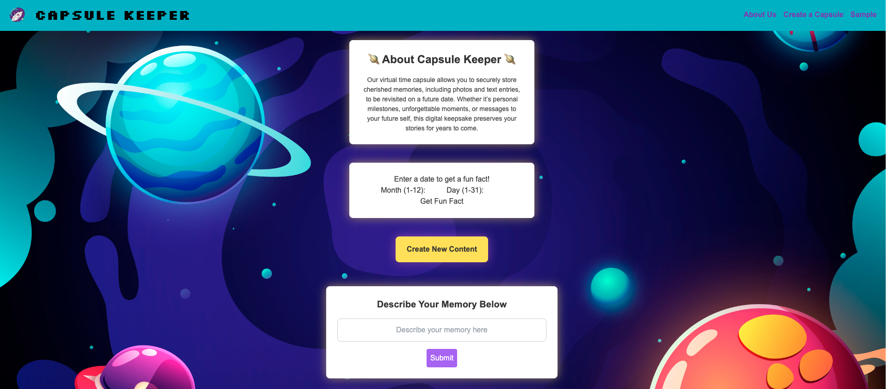

# capsule-keeper
We're creating a virtual time capsule where users can securely store memories, including images and text entries, to revisit in the future. Preserve your special moments and personal reflections, lock them away, and set a date to unlock them later. Keep your memories safe and meaningful for years to come!

## Link to Deployed Application
https://mykull06.github.io/capsule-keeper/

## Screenshot

## How-to-Use Guide

* Select Create New button to open a modal. In the modl, select the files you'd like to add. 

* Add your images

* Add your description

* Select a date to get a fun fact (Optional: add to your capsule description)
